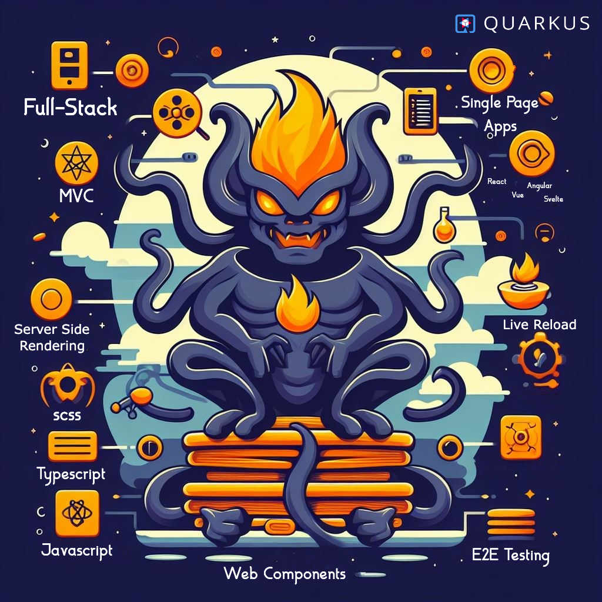

## Quarkus for the Web `the hitch-hiker's guide`

---

# 👻

- Martin Kouba `@martunek`
- Stéphane Epardaud `@UnFroMage`
- Andy Damevin `@ia3andy`

---

### What is Quarkus?

- Open Source framework for…
- Cloud-Native, Serverless, Micro-Services, Lambdas, Command-Lines…
- And Web Applications!

---

### Why Quarkus?

- Developer Joy
- Container First
- Community and Standards
- Imperative and Reactive

---

### What is an extension?

- Adds `functionality` to a Quarkus application
- Not just a `plain` dependency
- Consists of two parts:
  - `build-time` module (hidden)
  - `runtime` module

--

### Where can I find extensions?


quarkus.io/extensions

--

### Can I contribute a new extension?

Yes, meet the [Quarkiverse Hub](https://github.com/quarkiverse)!

A GitHub organization that provides repository hosting (including build, CI and release publishing setup) for Quarkus extensions contributed by the community.

---

### Why use Quarkus for the Web?

Its advanced and versatile stack makes it the best choice for your Web projects!

➕ the Dev-Joy!

--

<!-- .element width="70%"  -->

--

<!-- .element width="60%"  -->

[red.ht/one-two-three-quarkus-jcon](red.ht/one-two-three-quarkus-jcon)

---

## Web Bundler

`zero conf` bundling and minification for:
- web dependencies in `pom.xml` (Lit, Htmx, Bootstrap, React, ...)
- scripts (js, ts, jsx, tsx)
- and styles (css, scss, sass).

--

<!-- .element width="100%"  -->


---

## Quinoa
<br/>
<div style="display: flex; align-items: center;justify-content: center;gap:30px ">
 ➕ 
</div>
<br/>

- with `package.json` 
- integrated proxy for `dev`
- framework detection (React, Angular, Vue, ...)

---

# Qute

Qute is a _templating engine_ designed to meet Quarkus needs.

---

### Qute - goals

- Simple but powerful syntax 
- Easily extensible API
- Type-safe templates to enable build-time validation (optional)
- Minimize reflection usage
- Support async data types (`Uni`, `CompletionStage`) out-of-the-box
- ... a first-class Quarkus citizen!

--

### Qute - simple syntax

 The dynamic parts of a template include _comments_, _output expressions_, _sections_ and _unparsed character data_.

```html
{! A simple comment !}
<h1>{item.name ?: 'Dummy'}</h1>
{#if item.active}
<p>{item.description}</p>
{/if}
{| <script>if(true){alert('Qute is cute!')};</script> |}
```

--

### Qute - extensible API example

Template extension methods can be used to extend the data classes with new functionality.

For example, it is possible to add _computed properties_ and _virtual methods_ to existing Java types.

```java
@TemplateExtension
public static String toMonthStr(LocalDate date) {
   return date.getMonth().getDisplayName(TextStyle.SHORT, Locale.getDefault());
}
```

--

### Qute - type-safe templates

The goal is to catch user errors during the build and fail fast.

--

### Qute - type-safe templates

#1 - directly in the template.

```html
{@java.lang.String name} 
<html>
<body>
  Hello {name.toLowerCase}!
</body>
</html>
```

--

### Qute - type-safe templates

#2 - directly in the code. 

```java
@CheckedTemplate
class Templates {
    static native TemplateInstance hello(String name);  
}
```

--

### Qute - type-safe templates

#3 - records (Java 14+)

```java
record Hello(String name) implements TemplateInstance {}
```

--

### Qute - type-safe templates

#4 - `@Named` CDI beans

```html
<html>
<body>
  Hello {cdi:bean.name.toLowerCase}!
</body>
</html>
```

--

### Qute - async data resolution API

Allows for better resource utilization and fits the Quarkus reactive model.

For example, it’s possible to use _non-blocking clients_ directly from a template.

--

### Qute - tight Quarkus integration

- Dev mode and UI
- CDI integration (`{cdi:myBean.foo}`, `@Inject Template`, ...)
- `quarkus-rest-qute`
- `quarkus-mailer`
- ...

---

## Qute Web

 It's a Quarkiverse extension. The goal is to expose the Qute templates located in the `src/main/resource/templates/pub` directory via HTTP. Automatically, no controllers needed.

--

### Qute Web - accesible data

- `@Named` CDI beans; `{cdi:myBean.name}`
- static members of a class annotated with `@TemplateData`
- enums annotated with `@TemplateEnum`
- the current HTTP request and query parameters; `{http:request.path}` and `{http:param('name')}`
- global variables
- ...

---

<!-- .element width="60%"  -->

---

## Renarde 🦊

- An old-school Web Framework
- Server-side rendering for views (Qute)
- Model with Hibernate with Panache
- Controllers with RESTEasy Reactive and magic

---

### Your first controller

```java
public class Application extends Controller {

	@CheckedTemplate
	public static class Templates {
		public static native TemplateInstance index(String message);
	}

	@Path("/")
	public TemplateInstance index(){
		return Templates.index("Hello Slovenia");
	}
}
```

--

### Your first view

```html
{#include main.html}
{#title}Index page{/title}

<h1>We have a message for you: {message}</h1>
```

--

### Your first entity

```java
@Entity
public class Todo extends PanacheEntity {
	public String task;
	public LocalDate done;
	
	public static List<Todo> listTodos(){
		return listAll(Sort.by("id"));
	}

	public static List<Todo> listDone(){
		return list("done is not null", Sort.by("done"));
	}
}
```

---

### Using the model, controller side

```java
public class Todos extends Controller {

	@CheckedTemplate
	public static class Templates {
		public static native TemplateInstance index(List<Todo> todos);
	}

	public TemplateInstance index(){
		return Templates.index(Todo.listTodos());
	}
}
```

--

### Using the model, view side

```html
{#include main.html}
{#title}List of tasks{/title}

<ul>
{#for todo in todos}
	<li>{todo.task} done: {todo.done}</li>
{/for}
</ul>
```

---

### Need an controller action? 1/2

```java
public class Todos extends Controller {

	@CheckedTemplate
	public static class Templates {
		public static native TemplateInstance edit(Todo todo);
	}

	public TemplateInstance edit(@RestPath String id){
		Todo todo = Todo.findById(id);
		notFoundIfNull(id);
		return Templates.edit(todo);
	}

	…
```
--

### Need an controller action? 2/2

```java
	…
	
	@POST
	public void save(@RestPath String id, 
	                 @RestForm task, 
	                 @RestForm LocalDate done){
		Todo todo = Todo.findById(id);
		notFoundIfNull(id);
		todo.task = task;
		todo.done = done;
		index();
	}
}
```
--

### The view side

```html
{#include main.html}
{#title}Edit task{/title}

<form action="{uri:Todos.save(todo.id)}" method="POST">
	{#authenticityToken/}
	<input name="task" value="{todo.task}"/>
	<input name="done" type="date" value="{todo.done}"/>
	<button>Save</button>
</form>
```

---

### Validation, in your controller

```java
	@POST
	public void save(@RestPath String id,
		             @RestForm @NotBlank task,
		             @RestForm LocalDate done){
		Todo todo = Todo.findById(id);
		notFoundIfNull(id);
		if(validationFailed()) {
			edit(id);
		}
		todo.task = task;
		todo.done = done;
		index();
	}
```

--

### Validation, in your view

```html
	{#ifError 'task'}Error: {#error 'task'/}{/ifError}
	<input name="task" value="{flash:task ?: todo.task}"/>
```

---

### Localisation: configuration

Configure it in your `application.properties`:

```properties
# This is the default locale for your application
quarkus.default-locale=en
# These are the supported locales (should include the default locale,
# but order is not important)
quarkus.locales=en,fr
```
--

### Localisation: default messages

Set your messages in `messages.properties`:

```properties
# A simple message
hello=Hello World
# A parameterised message for your view
views_Application_index_greet=Hello %s
```

--

### Localisation: localised messages

Set your messages in `messages_fr.properties`:

```properties
hello=Bonjour Monde
views_Application_index_greet=Salut %s
```

--

### Localisation: use it from your controller

```java
public String hello() {
    return i18n.formatMessage("hello");
}
```
--

### Localisation: use it from your view

```html
With no parameter:
{m:hello}

With parameters:
{m:views_Application_index_greet(name)}
```

---

### Emails: declaring them

```java
public class Emails {

    @CheckedTemplate
    static class Templates {
        public static native MailTemplateInstance notify(User user);
    }

    public static void notify(Todo todo) {
        Templates.notify(todo)
        .subject("[Todos] We wanted to let you know")
        .to(todo.owner.email)
        .from("Todos <todos@example.com>")
        .send().await().indefinitely();
    }
}
```
--
### Emails: the controller

```java
@POST
public void saveTodo(…){
	…
	Emails.notify(todo);
	index();
}
```
--

### Emails: the view

```html
{#include email.html}

<p>
 We got a notification about {todo.task}
</p>

<p>
 <a href="{uriabs:Todos.view(todo.id)}">View it online</a>.
</p>
```

\* Also supports the plain text variant

---

### Other features

- Generating PDFs from views
- Generating barcodes
- A generated backoffice for your entities
- A Database transporter
- Helper methods for password or webauthn authentication, OIDC

---

## HTMX

All this is fine, and old-school, but if what if you want to do partial page updates, get some
of this AJAX action going?

--

HTMX allows you to turn your pages into AJAX pages without writing JavaScript, by declaring AJAX
actions and consequences as custom HTML attributes.

--

```html
<a hx-get="{uri:Application.hello()}">Click me</a>
```

This will do an AJAX `GET` of that
controller and replace the contents with what it returns.


You can use other HTMX attributes to define what to do with the results.

---

## HTMX fragments

You can declare fragments of your template:

```html
{#fragment id="entries"}
<ul>
    {#for entry in entries}
    <li>{entry.published}: {entry.title}</li>
    {/for}
</ul>
{/fragment}
```

--

```java
public class Cms extends HxController {
  @CheckedTemplate
  public static class Templates {
    static native TemplateInstance index(List<BlogEntry> entries);

    static native TemplateInstance 
                           index$entries(List<BlogEntry> entries);
  }
  public TemplateInstance index() {
    if (isHxRequest())
        return Templates.index$entries(BlogEntry.listAll());
    return Templates.index(BlogEntry.listAll());
  }
}
```

---

## Turning HTML into HTMX

- Add `hx-get`, `hx-post` and other attributes to your views
- Add `#fragment` to your views
- Make your controller extend `HxController`
- Declare the fragments in your controller
- Define partial-rendering outcomes from your endpoints
- Profit!

---

## Conclusion

1. Use Quarkus 
2. Add Web
3. ?!?!
4. Profit

---

Any questions?
